# OpenCode Context Deep Dive: Complete Guide

**Last verified:** Dec 7, 2025  
**Source code verified:** `packages/opencode/src/session/system.ts`, `prompt.ts`, `transform.ts`

---

## 🎯 Context in 60 Seconds

Every time you send a message to OpenCode, it builds a **context** (like a brief for the AI). Think of it like preparing a sandwich:

```
🍞 Header         → "You are Claude" (if using Anthropic)            ~12 tokens
🥬 Base Prompt    → Big instructions (1,300-3,900 words)              ~2,000 tokens
🧀 Environment    → "You're in /Users/you/project, 50 files..."      ~200 tokens
🥓 Your Rules     → AGENTS.md, CLAUDE.md (your custom instructions)  ~500 tokens
🍖 Tools          → "You can read, write, edit..." (16 tools)         ~6,600 tokens
🍞 Your Message   → "Fix the bug in auth.ts"                          ~10 tokens
                                                           ─────────────────────────
                                                           Total: ~9,322 tokens
```

### 💰 The Cost Story

**Without Caching (Ollama, most models):**
- Every request: 9,322 tokens × full price
- Or FREE (local models like Ollama)
- 🚨 Problem: Uses 50-100% of small context windows!

**With Caching (Claude/Anthropic only):**
- First request: 9,322 tokens × full price = $0.028
- Next requests: 9,000 cached (10% price) + 322 new = $0.004
- **Savings: 85% cheaper!** Cache lasts 5 minutes
- Static parts (base prompt, tools) reused automatically

**The TUI shows total tokens INCLUDING cached reads, so high numbers are actually GOOD for Claude!**

---

## 🔄 How Caching Actually Works

### What Gets Cached?

**OpenCode caches specific messages automatically:**

```typescript
// From: packages/opencode/src/provider/transform.ts:23-63

const system = msgs.filter((msg) => msg.role === "system").slice(0, 2)
const final = msgs.filter((msg) => msg.role !== "system").slice(-2)
```

**Translation:** OpenCode marks these messages as cacheable:
1. **First 2 system messages** (base prompt, environment+tools)
2. **Last 2 conversation messages** (your previous question + AI's answer)

**Visual example:**

```
Request 1: "Fix auth bug"
├─ [System 1] Header + Base Prompt          [CACHEABLE ✅]
├─ [System 2] Environment + Custom + Tools  [CACHEABLE ✅]
├─ [User] "Fix auth bug"                    [NOT CACHED]
└─ [Assistant] "Here's the fix..."          [NOT CACHED]

Request 2: "Add tests"  
├─ [System 1] Header + Base Prompt          [CACHE HIT! 💰]
├─ [System 2] Environment + Custom + Tools  [CACHE HIT! 💰]
├─ [User] "Fix auth bug"                    [CACHEABLE ✅]
├─ [Assistant] "Here's the fix..."          [CACHEABLE ✅]
├─ [User] "Add tests"                       [NOT CACHED]
└─ [Assistant] "Here are the tests..."      [NOT CACHED]

Request 3: "Explain the tests"
├─ [System 1] Header + Base Prompt          [CACHE HIT! 💰]
├─ [System 2] Environment + Custom + Tools  [CACHE HIT! 💰]
├─ ... (earlier messages truncated)
├─ [User] "Add tests"                       [CACHE HIT! 💰]
├─ [Assistant] "Here are the tests..."      [CACHE HIT! 💰]
├─ [User] "Explain the tests"               [NOT CACHED]
└─ [Assistant] "The tests work by..."       [NOT CACHED]
```

### How It's Stored

**Caching happens on the provider's servers (not locally):**

1. **Anthropic receives your request** with special markers:
   ```json
   {
     "messages": [
       {
         "role": "system",
         "content": "You are Claude...",
         "cache_control": { "type": "ephemeral" }  // ← Cache marker
       }
     ]
   }
   ```

2. **Anthropic computes a hash** of the message content
   - Same content = Same hash = Cache hit!
   - One character change = Different hash = Cache miss

3. **Cache is stored on Anthropic's servers** for your API key
   - Keyed by: message content hash + your API key
   - Not shared between users
   - Not stored locally

4. **OpenCode tracks cache status** in message metadata:
   ```json
   {
     "tokens": {
       "input": 1200,
       "cache": {
         "read": 8500,    // ← Anthropic says "I already have this"
         "write": 0       // ← New content added to cache
       }
     }
   }
   ```

### Cache Expiration & Refresh

**Lifespan:** 5 minutes of inactivity

```
0:00 - Request 1: Cache written (full price)
0:30 - Request 2: Cache hit! (10% price)
1:00 - Request 3: Cache hit! (10% price)
4:50 - Request 4: Cache hit! (10% price)
... (silence for 5 minutes)
10:00 - Request 5: Cache expired, rebuilt (full price)
10:30 - Request 6: Cache hit again! (10% price)
```

**Auto-refresh:** Every cache hit resets the 5-minute timer

### Which Providers Support Caching?

**Source:** `packages/opencode/src/provider/transform.ts:65-74`

```typescript
export function message(msgs: ModelMessage[], providerID: string, modelID: string) {
  if (providerID === "anthropic" || modelID.includes("anthropic") || modelID.includes("claude")) {
    msgs = applyCaching(msgs, providerID)
  }
  return msgs
}
```

**Verified Provider Support:**

| Provider | Models | Caching Support | Cache Format | Notes |
|----------|--------|-----------------|--------------|-------|
| **Anthropic** | Claude 3.5 Sonnet<br/>Claude 3.5 Haiku<br/>Claude 3 Opus/Sonnet | ✅ **Yes** | `cacheControl: { type: "ephemeral" }` | Native support, best implementation |
| **OpenRouter** | When routing to Claude | ✅ **Yes** | `cache_control: { type: "ephemeral" }` | Only if backend is Anthropic |
| **AWS Bedrock** | Claude on Bedrock | ✅ **Yes** | `cachePoint: { type: "ephemeral" }` | AWS-specific format |
| **OpenAI** | GPT-4, GPT-4 Turbo<br/>o1, o3, GPT-5 | ⚠️ **Different** | `promptCacheKey: sessionID` | Different system, not as effective |
| **OpenCode API** | Big Pickle | ✅ **Yes** | Routes through Anthropic | Backend uses Anthropic, so caching works |
| **Ollama** | All local models | ❌ **No** | N/A | Local models don't support caching |
| **LM Studio** | All local models | ❌ **No** | N/A | Local server, no cloud cache |
| **Together AI** | Qwen, Llama, etc. | ❌ **No** | N/A | No caching support |
| **Google AI** | Gemini 1.5, 2.0 | ❌ **No** | N/A | Not supported by provider |
| **Azure OpenAI** | GPT-4 on Azure | ⚠️ **Varies** | Depends on Azure config | Check your Azure setup |

### How to Tell if Caching is Working

**Method 1: Check Token Breakdown**

```bash
# View your session tokens
cat ~/.local/share/opencode/storage/message/ses_YOUR_ID/*.json | jq '.tokens'

# If you see this, caching is working:
{
  "cache": {
    "read": 8500  // ← Non-zero = cache hit!
  }
}

# If you see this, no caching:
{
  "cache": {
    "read": 0     // ← Zero = no cache support
  }
}
```

**Method 2: TUI Display**

```
Context
9,842 tokens   ← If this stays HIGH but cost stays LOW = caching works!
```

**Method 3: Cost Pattern**

```
Request 1: $0.028  (first request)
Request 2: $0.004  (85% cheaper)
Request 3: $0.004  (still cheap)
```

If costs drop dramatically after first request = caching works!

### Why Some Models Show Cache But Shouldn't

**Big Pickle Mystery Solved:**

```
Your Setup:
├─ You select: "Big Pickle" (Ollama model)
├─ OpenCode CLI sends to: OpenCode API
└─ OpenCode API routes to: Anthropic Claude API
                            ↑
                      Cache happens here!
```

**That's why you see:**
- `cache.read: 8500` tokens (from Anthropic)
- Costs are charged (not free like local Ollama)
- Same caching behavior as Claude

**It's not really Ollama - it's Claude with a different name!**

### Cache Optimization Tips

**For Anthropic/Claude:**
1. ✅ Keep long system prompts (they get cached)
2. ✅ Enable all tools you might need (cached after first use)
3. ✅ Long conversations benefit more (2+ messages)
4. ✅ Work in bursts under 5 minutes (cache stays warm)
5. ❌ Don't optimize context size (caching makes it cheap)

**For Non-Caching Models:**
1. ✅ Minimize system prompts aggressively
2. ✅ Disable unused tools
3. ✅ Remove custom instructions
4. ✅ Use agent prompt overrides
5. ❌ Don't rely on "cheaper subsequent requests"

### Technical: Cache Control Application

**Source:** `packages/opencode/src/provider/transform.ts:23-63`

```typescript
function applyCaching(msgs: ModelMessage[], providerID: string): ModelMessage[] {
  const system = msgs.filter((msg) => msg.role === "system").slice(0, 2)
  const final = msgs.filter((msg) => msg.role !== "system").slice(-2)

  const providerOptions = {
    anthropic: { cacheControl: { type: "ephemeral" } },
    openrouter: { cache_control: { type: "ephemeral" } },
    bedrock: { cachePoint: { type: "ephemeral" } },
    openaiCompatible: { cache_control: { type: "ephemeral" } },
  }

  // Apply cache markers to eligible messages
  for (const msg of unique([...system, ...final])) {
    msg.providerOptions = {
      ...msg.providerOptions,
      ...providerOptions[providerID]
    }
  }
  
  return msgs
}
```

**What this does:**
1. Finds first 2 system messages
2. Finds last 2 conversation messages  
3. Adds provider-specific cache markers
4. Provider sees markers and caches those messages

---

## 📊 Visual Flow: How Context is Built

```mermaid
graph TD
    A[You type message] --> B{OpenCode starts building context}
    
    B --> C[1️⃣ Add Header]
    C --> C1[Anthropic: 'You are Claude'<br/>Others: Nothing]
    
    B --> D[2️⃣ Add Base Prompt]
    D --> D1{Which model?}
    D1 -->|Claude| D2[anthropic.txt<br/>1,335 words]
    D1 -->|GPT-4| D3[beast.txt<br/>1,904 words]
    D1 -->|GPT-5| D4[codex.txt<br/>3,940 words]
    D1 -->|Gemini| D5[gemini.txt<br/>2,235 words]
    D1 -->|Others/Ollama/Big Pickle| D6[qwen.txt<br/>1,596 words]
    
    B --> E[3️⃣ Add Environment]
    E --> E1[Working directory<br/>Project tree<br/>Date & platform]
    
    B --> F[4️⃣ Search for Custom Instructions]
    F --> F1{Find local files?}
    F1 -->|Yes| F2[Load AGENTS.md<br/>or CLAUDE.md]
    F1 -->|No| F3[Check global<br/>~/.claude/CLAUDE.md]
    
    B --> G[5️⃣ Add Tool Definitions]
    G --> G1{Which tools enabled?}
    G1 -->|Agent config| G2[Load descriptions<br/>for enabled tools]
    G1 -->|All by default| G3[Load all 16 tools<br/>~6,600 tokens!]
    
    C1 & D2 & D3 & D4 & D5 & D6 & E1 & F2 & F3 & G2 & G3 --> H[6️⃣ Combine Everything]
    
    H --> I[7️⃣ Apply Caching]
    I --> I1{Anthropic/Claude?}
    I1 -->|Yes| I2[Mark first 2 system<br/>messages as cacheable]
    I1 -->|No| I3[No caching]
    
    I2 & I3 --> J[8️⃣ Add Your Message]
    
    J --> K[Send to AI Model]
    
    K --> L{First request?}
    L -->|Yes| M[Full cost:<br/>All tokens charged]
    L -->|No + Cached| N[Discounted:<br/>90% cached at 10% cost]
    
    M & N --> O[AI Responds]
    
    style A fill:#e1f5ff
    style K fill:#fff4e1
    style M fill:#ffe1e1
    style N fill:#e1ffe1
    style O fill:#f0e1ff
```



---

## 🏗️ The Layer Cake Metaphor

Think of OpenCode context like building a **layer cake** for the AI to "eat":

### Layer 1: The Foundation (Header)
- **What:** A tiny label saying who the AI is
- **Size:** 0-12 tokens
- **Example:** "You are Claude, made by Anthropic"
- **Why:** Some models need this identity reminder

### Layer 2: The Recipe Book (Base Prompt)
- **What:** Detailed instructions on how to behave
- **Size:** 1,300-3,900 words (1,700-5,100 tokens!)
- **Example:** "Be concise. Use tools. Don't write malicious code..."
- **Why:** Different models need different instruction styles
- **🚨 Problem:** This layer is HUGE and different per model!

### Layer 3: The Kitchen Tour (Environment)
- **What:** Info about the project you're working in
- **Size:** 40-600 tokens
- **Example:** "You're in /project, here's the file tree with 50 files..."
- **Why:** AI needs to know what files exist and where it is

### Layer 4: The House Rules (Custom Instructions)
- **What:** YOUR personal preferences and rules
- **Size:** 0-5,000 tokens (highly variable)
- **Files:** `AGENTS.md`, `CLAUDE.md`, or files in `config.instructions`
- **Example:** "Always use TypeScript. Follow our style guide..."
- **Why:** Customize AI behavior for your team/workflow

### Layer 5: The Toolbox Manual (Tool Definitions)
- **What:** Descriptions of what tools the AI can use
- **Size:** 0-6,600 tokens (330-1,900 per tool)
- **Example:** "read: Read file contents. write: Create new files..."
- **Why:** AI needs to know what actions it can take
- **🚨 Problem:** All 16 tools = 6,600 tokens by default!

### Layer 6: Your Request (The Actual Question)
- **What:** What you just typed
- **Size:** ~1.3 tokens per word
- **Example:** "Fix the authentication bug in auth.ts"
- **Why:** This is what you want help with!

---

## 💡 The Key Insight: Most Context is STATIC

```
┌─────────────────────────────────────────┐
│ STATIC CONTENT (Same Every Request)     │ 8,000-10,000 tokens
├─────────────────────────────────────────┤
│ • Base Prompt      → 2,000 tokens       │ ← Huge!
│ • Tool Definitions → 6,600 tokens       │ ← Wasteful if unused!
│ • Environment      →   200 tokens       │
│ • Custom Rules     →   500 tokens       │
└─────────────────────────────────────────┘
         ↓ This repeats EVERY request
         
┌─────────────────────────────────────────┐
│ DYNAMIC CONTENT (Changes Each Request)  │ 10-100 tokens
├─────────────────────────────────────────┤
│ • Your Message     →    15 tokens       │
└─────────────────────────────────────────┘
```

**Without caching:** You pay for all 8,000+ tokens every time!  
**With caching (Anthropic):** You pay full price once, then 10% for the static parts!

---

## 🎭 Different Models = Different Base Layers

Here's why you see different token counts for different models:

| Model | Base Prompt | Size | Why Different? |
|-------|------------|------|----------------|
| **Claude** | anthropic.txt | 1,736 tokens | Optimized for Claude's style |
| **GPT-4** | beast.txt | 2,475 tokens | Detailed reasoning instructions |
| **GPT-5** | codex.txt | 5,122 tokens | Advanced multi-step guidance |
| **Gemini** | gemini.txt | 2,906 tokens | Google-specific format |
| **Ollama/Big Pickle** | qwen.txt | 2,075 tokens | Open-source model format |

**🚨 Key Point:** Your Ollama model gets the same 2,075-token prompt as GPT-4, even though it has a tiny 8k context window!

---

## 🔄 How Caching Saves You Money

**First Request (No Cache):**
```
Request 1: "Hi"
├─ Base Prompt:        2,000 tokens × $3.00/1M  = $0.0060
├─ Tools:              6,600 tokens × $3.00/1M  = $0.0198
├─ Environment:          200 tokens × $3.00/1M  = $0.0006
├─ Your Message:          10 tokens × $3.00/1M  = $0.0000
└─ AI Response:          100 tokens × $15.00/1M = $0.0015
                                    Total: $0.0279
```

**Second Request (With Cache):**
```
Request 2: "Thanks"
├─ Base Prompt:        2,000 tokens × $0.30/1M  = $0.0006 (cached!)
├─ Tools:              6,600 tokens × $0.30/1M  = $0.0020 (cached!)
├─ Environment:          200 tokens × $0.30/1M  = $0.0001 (cached!)
├─ Your Message:          10 tokens × $3.00/1M  = $0.0000
└─ AI Response:          100 tokens × $15.00/1M = $0.0015
                                    Total: $0.0042
                                    
Savings: 85% cheaper!
```

**🎁 Cache expires after 5 minutes of inactivity, then rebuilds automatically.**

---

## 🎯 The Problem (And Solutions)

### Problem 1: Local Models (Ollama) Waste Context

```
Ollama Model: 8,000 token context limit
├─ Base Prompt:        2,075 tokens (26%!) 😱
├─ Tools:              6,600 tokens (82%!) 😱😱
└─ Remaining for you:  -675 tokens ❌ DOESN'T FIT!
```

**Solution:** Minimize everything (see optimization section below)

### Problem 2: You Don't Control Base Prompts

You can't easily change the 2,000+ token base prompt without editing source code.

**Solution:** Override with agent `prompt:` field (explained below)

### Problem 3: Tools Load By Default

All 16 tools = 6,600 tokens, even if you only need 3.

**Solution:** Explicitly disable unused tools (explained below)

---

## 🚀 Quick Wins

Before diving into the technical details, here are the fastest ways to reduce context:

### For Claude/Anthropic (Use Full Context)
```yaml
# Don't optimize - caching makes it cheap!
# Keep all tools and instructions
```

### For Ollama (Minimize Everything)
```yaml
# .opencode/agent/ollama.md
---
description: "Ollama optimized"
prompt: "Code assistant"  # ← Replaces 2,075 token base prompt!
tools:
  read: true
  write: true
  edit: true
  # All others automatically false = Saves 5,900 tokens!
---
```

```bash
# Remove custom instructions
mv ~/.claude/CLAUDE.md ~/.claude/CLAUDE.md.disabled  # Saves 200-2,000 tokens

# Result: 750 tokens instead of 8,000+ (91% reduction!)
```

---

---

## 🔍 How to Verify Context for Your Setup

Before diving into details, here's how to check what context YOUR agents are using:

### Method 1: Count Agent Tokens (Script)

```bash
# Run the token counting script
cd /Users/darrenhinde/Documents/GitHub/opencode
./script/count-agent-tokens.sh AGENT_NAME MODEL_ID PROVIDER

# Examples:
./script/count-agent-tokens.sh build claude-sonnet-4 anthropic
./script/count-agent-tokens.sh ollama qwen2.5:latest ollama
./script/count-agent-tokens.sh your-custom-agent big-pickle opencode

# Output shows:
# - Base prompt tokens
# - Environment tokens
# - Custom instruction files found
# - Tool tokens
# - Total estimated tokens
```

### Method 2: Check TUI During Session

When you run OpenCode in TUI mode:

```bash
opencode  # Start TUI

# Top right shows:
Context
9,842 tokens   ← Total tokens (includes cached!)
12% used       ← % of context window
$0.00 spent    ← Cost so far
```

**🎯 Key Insight:** The token count includes `cache.read` tokens, so:
- **High number + Claude = GOOD** (90% of it is cached/cheap)
- **High number + Ollama = BAD** (eating your limited context)

### Method 3: Inspect Session Data (Advanced)

```bash
# Find your session ID in TUI (top of screen: "Session: ses_...")
SESSION_ID="ses_YOUR_SESSION_ID_HERE"

# View token breakdown
cat ~/.local/share/opencode/storage/message/$SESSION_ID/*.json | \
  jq '.tokens'

# Example output:
{
  "input": 1200,        ← New tokens this request
  "output": 150,        ← AI response tokens
  "reasoning": 0,       ← Reasoning tokens (o1/o3 only)
  "cache": {
    "read": 8500,       ← Reused from cache (cheap!)
    "write": 0          ← New cache writes
  }
}

# Calculate real cost:
# Cached: 8500 × $0.30/1M = $0.0026
# Input:  1200 × $3.00/1M = $0.0036
# Output:  150 × $15.00/1M = $0.0023
# Total: $0.0085 (not $0.0285 without cache!)
```

### Method 4: Check What Files Are Loaded

```bash
# Find custom instruction files being loaded
cd your-project
find . -name "AGENTS.md" -o -name "CLAUDE.md" -o -name "CONTEXT.md" 2>/dev/null

# Check global files
ls -la ~/.config/opencode/AGENTS.md 2>/dev/null
ls -la ~/.claude/CLAUDE.md 2>/dev/null

# Count words in custom files
wc -w .opencode/AGENTS.md ~/.claude/CLAUDE.md

# Estimate tokens (words × 1.3)
```

### Method 5: List Enabled Tools

```bash
# Check your opencode.json
cat opencode.json | jq '.tools'

# Or check agent config
cat .opencode/agent/your-agent.md | grep -A 20 "tools:"

# Count enabled tools:
# Each tool ≈ 200-1,800 tokens
# All 16 tools ≈ 6,600 tokens total
```

### Quick Diagnostic Table

| Symptom | Likely Cause | Fix |
|---------|--------------|-----|
| 8,000+ tokens on "Hi" | Base prompt + all tools loaded | Use minimal agent, disable tools |
| Same tokens every request | No caching OR local model | Switch to Claude for caching |
| 9k cache + 1k input | Perfect! Caching working | Nothing, this is optimal! |
| Context 90% used (Ollama) | Too much context for small window | Minimize base prompt, disable tools |
| Can't fit full context | Project too large + tools + prompt | Reduce tool count, use agent override |

### Example Verification Session

```bash
# 1. Create minimal agent
cat > .opencode/agent/test.md << 'EOF'
---
description: "Test minimal context"
prompt: "Code assistant"
tools:
  read: true
---
EOF

# 2. Count tokens
./script/count-agent-tokens.sh test qwen2.5:latest ollama

# 3. Compare before/after
# Before: ~8,000 tokens
# After: ~400 tokens
# Savings: 95%!

# 4. Test in TUI
opencode --agent test
# Type: "hi"
# Check Context in top right
```

---

Now let's dive into the technical details...

---

## Table of Contents

1. [How Context is Built (Step-by-Step)](#how-context-is-built)
2. [Model-Specific Prompts](#model-specific-prompts)
3. [How Caching Works](#how-caching-works)
4. [Custom Instruction Files](#custom-instruction-files)
5. [Tool Loading](#tool-loading)
6. [Optimization Strategies](#optimization-strategies)
7. [Complete Token Breakdown Examples](#complete-token-breakdown-examples)

---

## How Context is Built

Every request to the AI follows this exact sequence. Here's the verified code flow:

### Step 1: System Prompt Assembly

**Source:** `packages/opencode/src/session/prompt.ts:492-512`

```typescript
async function resolveSystemPrompt(input: {
  system?: string
  agent: Agent.Info
  providerID: string
  modelID: string
}) {
  let system = SystemPrompt.header(input.providerID)          // Step 1
  system.push(...(() => {                                     // Step 2
    if (input.system) return [input.system]
    if (input.agent.prompt) return [input.agent.prompt]
    return SystemPrompt.provider(input.modelID)
  })())
  system.push(...(await SystemPrompt.environment()))          // Step 3
  system.push(...(await SystemPrompt.custom()))               // Step 4
  
  // Combine into max 2 messages for caching
  const [first, ...rest] = system
  system = [first, rest.join("\n")]
  return system
}
```

### The 4 Components (In Order)

#### 1️⃣ **Header** (Provider-Specific)

**Source:** `packages/opencode/src/session/system.ts:20-23`

```typescript
export function header(providerID: string) {
  if (providerID.includes("anthropic")) return [PROMPT_ANTHROPIC_SPOOF.trim()]
  return []
}
```

**What gets added:**
- **Anthropic only:** "You are Claude, a large language model trained by Anthropic." (~9 words)
- **All others:** Nothing

**Token cost:**
- Anthropic: ~12 tokens
- Others: 0 tokens

---

#### 2️⃣ **Base Model Prompt** (Model-Specific)

**Source:** `packages/opencode/src/session/system.ts:25-31`

```typescript
export function provider(modelID: string) {
  if (modelID.includes("gpt-5")) return [PROMPT_CODEX]
  if (modelID.includes("gpt-") || modelID.includes("o1") || modelID.includes("o3")) 
    return [PROMPT_BEAST]
  if (modelID.includes("gemini-")) return [PROMPT_GEMINI]
  if (modelID.includes("claude")) return [PROMPT_ANTHROPIC]
  return [PROMPT_ANTHROPIC_WITHOUT_TODO]  // Default fallback
}
```

**Override Priority:**
1. If `--system "custom"` flag used → Use that
2. If agent has `prompt:` field → Use agent prompt
3. Otherwise → Select by model ID

**Verified Prompt Files & Token Counts:**

| Model Pattern | File | Words | Approx Tokens | Used By |
|--------------|------|-------|---------------|---------|
| `gpt-5` | codex.txt | 3,940 | ~5,122 | GPT-5, o1-pro, o1-2024-12-17 |
| `gpt-*`, `o1`, `o3` | beast.txt | 1,904 | ~2,475 | GPT-4, o1, o3 |
| `gemini-` | gemini.txt | 2,235 | ~2,906 | Gemini models |
| `claude` | anthropic.txt | 1,335 | ~1,736 | Claude 3.5, 3, etc. |
| **Default** | qwen.txt | 1,596 | **~2,075** | **Big Pickle, Ollama, DeepSeek, etc.** |

**🔥 Key Insight:** Models that don't match specific patterns (like Big Pickle, Ollama models, most local models) get the **qwen.txt** prompt by default, which is ~2,075 tokens!

---

#### 3️⃣ **Environment Context**

**Source:** `packages/opencode/src/session/system.ts:33-56`

```typescript
export async function environment() {
  const project = Instance.project
  return [
    [
      `Here is some useful information about the environment you are running in:`,
      `<env>`,
      `  Working directory: ${Instance.directory}`,
      `  Is directory a git repo: ${project.vcs === "git" ? "yes" : "no"}`,
      `  Platform: ${process.platform}`,
      `  Today's date: ${new Date().toDateString()}`,
      `</env>`,
      `<project>`,
      `  ${
        project.vcs === "git"
          ? await Ripgrep.tree({
              cwd: Instance.directory,
              limit: 200,  // ← Max 200 files shown
            })
          : ""
      }`,
      `</project>`,
    ].join("\n"),
  ]
}
```

**What gets added:**
1. Working directory path
2. Git repo status
3. Platform (darwin/linux/win32)
4. Today's date
5. **Project tree** (if git repo):
   - Up to 200 files
   - Shows directory structure
   - ~3-5 tokens per file

**Token cost:**
- Base info: ~40 tokens
- Project tree: ~3 tokens × number of files (max 200 files = ~600 tokens)
- **Typical:** 40-400 tokens depending on project size

---

#### 4️⃣ **Custom Instructions**

**Source:** `packages/opencode/src/session/system.ts:58-115`

This is the most misunderstood part! Let me show you exactly what gets loaded:

```typescript
const LOCAL_RULE_FILES = [
  "AGENTS.md",
  "CLAUDE.md",
  "CONTEXT.md", // deprecated
]

const GLOBAL_RULE_FILES = [
  path.join(Global.Path.config, "AGENTS.md"),        // ~/.config/opencode/AGENTS.md
  path.join(os.homedir(), ".claude", "CLAUDE.md"),   // ~/.claude/CLAUDE.md
]

export async function custom() {
  const config = await Config.get()
  const paths = new Set<string>()

  // 1. Search for LOCAL files (searches UP the directory tree)
  for (const localRuleFile of LOCAL_RULE_FILES) {
    const matches = await Filesystem.findUp(localRuleFile, Instance.directory, Instance.worktree)
    if (matches.length > 0) {
      matches.forEach((path) => paths.add(path))
      break  // ← STOPS after finding first matching file
    }
  }

  // 2. Check GLOBAL files (exact paths only)
  for (const globalRuleFile of GLOBAL_RULE_FILES) {
    if (await Bun.file(globalRuleFile).exists()) {
      paths.add(globalRuleFile)
      break  // ← STOPS after finding first global file
    }
  }

  // 3. Load files from config.instructions (if specified)
  if (config.instructions) {
    for (let instruction of config.instructions) {
      if (instruction.startsWith("~/")) {
        instruction = path.join(os.homedir(), instruction.slice(2))
      }
      let matches: string[] = []
      if (path.isAbsolute(instruction)) {
        matches = await Array.fromAsync(
          new Bun.Glob(path.basename(instruction)).scan({
            cwd: path.dirname(instruction),
            absolute: true,
            onlyFiles: true,
          }),
        ).catch(() => [])
      } else {
        matches = await Filesystem.globUp(instruction, Instance.directory, Instance.worktree)
          .catch(() => [])
      }
      matches.forEach((path) => paths.add(path))
    }
  }

  return Promise.all(Array.from(paths).map(...))
}
```

**Search Behavior (Critical!):**

1. **Local Files** (searches UP from current directory):
   - Looks for: `AGENTS.md`, `CLAUDE.md`, `CONTEXT.md`
   - Searches: Current dir → Parent → Grandparent → ... → Git root
   - **Stops:** After finding **first match** (all three files, or just one)
   
2. **Global Files** (exact paths):
   - `~/.config/opencode/AGENTS.md` OR
   - `~/.claude/CLAUDE.md`
   - **Stops:** After finding **first one**

3. **Config Instructions** (if you add to `opencode.json`):
   ```json
   {
     "instructions": [
       ".opencode/rules.md",
       "~/my-custom-rules.md"
     ]
   }
   ```
   - Supports globs
   - Loads ALL matches

**🚨 Common Misconceptions:**

❌ "OpenCode loads ALL .md files in .opencode/"  
✅ **ONLY** loads `AGENTS.md`, `CLAUDE.md`, `CONTEXT.md` (if found)

❌ "OpenCode loads from both local AND global"  
✅ Loads ONE local file + ONE global file (or until first match)

❌ "OpenCode always loads custom instructions"  
✅ Only if the specific files exist

**Token cost:**
- Varies widely: 0 - 5,000+ tokens depending on file content
- **Typical:** 50-500 tokens per file

---

### Step 2: Tool Definitions

**Source:** `packages/opencode/src/session/prompt.ts:514-522`

```typescript
async function resolveTools(input: {
  agent: Agent.Info
  sessionID: string
  modelID: string
  providerID: string
  tools?: Record<string, boolean>
  processor: Processor
}) {
  const tools: Record<string, AITool> = {}
  const enabledTools = pipe(
    input.agent.tools,                                  // 1. Agent config
    mergeDeep(await ToolRegistry.enabled(...)),         // 2. Default tools
    mergeDeep(input.tools ?? {}),                       // 3. Request override
  )
  
  // Only load enabled tools
  for (const item of await ToolRegistry.tools(...)) {
    if (Wildcard.all(item.id, enabledTools) === false) continue
    // ... load tool definition
  }
}
```

**Verified Tool Sizes (from source code):**

| Tool | Words | Tokens | Description Size |
|------|-------|--------|-----------------|
| todowrite | 1,380 | ~1,794 | Largest - complex schema |
| bash | 1,453 | ~1,889 | Large - detailed examples |
| task | 625 | ~812 | Medium - agent descriptions |
| multiedit | 416 | ~541 | Medium |
| edit | 227 | ~295 | Small-medium |
| read | 203 | ~264 | Small-medium |
| todoread | 177 | ~230 | Small-medium |
| webfetch | 148 | ~192 | Small |
| grep | 112 | ~146 | Small |
| write | 108 | ~140 | Small |
| glob | 94 | ~122 | Small |
| websearch | 77 | ~100 | Small |
| ls | 53 | ~69 | Tiny |
| lsp-hover | 3 | ~4 | Minimal |
| lsp-diagnostics | 3 | ~4 | Minimal |
| patch | 3 | ~4 | Minimal |

**Default Tool Set (if not specified):**
- All 16 tools enabled
- **Total: ~6,606 tokens** (verified by summing above)

**Tool Enable/Disable Logic:**

```yaml
# In agent config:
tools:
  read: true      # Explicitly enable
  write: false    # Explicitly disable
  # If not listed, uses default (usually enabled)
```

**🔥 Critical:** Tools are **opt-out**, not opt-in! If you don't set `false`, they load by default.

---

### Step 3: Message History

Your conversation messages (user + assistant) are added after system prompts and tools.

**Token cost:**
- Your input: ~1.3 tokens per word
- Previous messages: Accumulates with conversation history

---

## Model-Specific Prompts

### Why Different Models Get Different Prompts

Each model family has different:
- **Instruction-following style**
- **Output formatting preferences**
- **Tool-calling conventions**
- **Context window sizes**

### Prompt Selection Logic

**Source:** `packages/opencode/src/session/system.ts:25-31`

```typescript
if (modelID.includes("gpt-5")) return [PROMPT_CODEX]
if (modelID.includes("gpt-") || modelID.includes("o1") || modelID.includes("o3")) 
  return [PROMPT_BEAST]
if (modelID.includes("gemini-")) return [PROMPT_GEMINI]
if (modelID.includes("claude")) return [PROMPT_ANTHROPIC]
return [PROMPT_ANTHROPIC_WITHOUT_TODO]  // ← Default
```

### Detailed Prompt Comparison

#### 1. **Claude (anthropic.txt)** - 1,335 words, ~1,736 tokens

**Optimized for:**
- Claude 3.5 Sonnet, Claude 3 Opus
- Anthropic's instruction-following style
- Tool use patterns

**Key features:**
- Concise, direct instructions
- Emphasizes "think step-by-step"
- Specific tool usage examples
- Citations format

**Sample excerpt:**
```
You are opencode, an AI assistant specialized in software engineering...
IMPORTANT: Keep responses short and to the point.
When using tools, plan your approach before executing.
```

---

#### 2. **Qwen/Default (qwen.txt)** - 1,596 words, ~2,075 tokens

**Used by:**
- Big Pickle
- Ollama models (llama, qwen, deepseek, etc.)
- Any model not matching other patterns

**Optimized for:**
- Open-source models
- Models with smaller context windows
- General-purpose instruction following

**Key differences from Claude:**
- More verbose examples
- Detailed tool explanations
- Explicit formatting instructions
- Less assumption about model capabilities

**Sample excerpt:**
```
You are opencode, an interactive CLI tool that helps users with software engineering tasks...
IMPORTANT: Refuse to write code or explain code that may be used maliciously...
When the user asks about opencode, use WebFetch tool to gather information...
```

**🚨 Why this matters for Ollama:**
- Ollama models often have 4k-32k context
- 2,075 tokens is 6-50% of total context!
- No caching support = every token costs

---

#### 3. **Beast (beast.txt)** - 1,904 words, ~2,475 tokens

**Used by:**
- GPT-4, GPT-4 Turbo
- o1, o1-mini
- o3

**Optimized for:**
- OpenAI's reasoning models
- Structured thinking
- Chain-of-thought

**Key features:**
- More detailed reasoning instructions
- Explicit step-by-step guidance
- Tool composition patterns

---

#### 4. **Codex (codex.txt)** - 3,940 words, ~5,122 tokens

**Used by:**
- GPT-5 (when available)
- Future advanced models

**Optimized for:**
- Multi-step complex tasks
- Code generation at scale
- Advanced reasoning

**Why so large:**
- Comprehensive tool documentation
- Complex workflow examples
- Advanced patterns

---

#### 5. **Gemini (gemini.txt)** - 2,235 words, ~2,906 tokens

**Used by:**
- Gemini 1.5 Pro
- Gemini 2.0

**Optimized for:**
- Google's instruction format
- Gemini-specific features
- Multi-modal capabilities

---

### How to Override Model Prompt

#### Method 1: Agent Prompt Override

```yaml
---
description: "Custom agent"
mode: primary
prompt: |
  You are a helpful assistant. Be concise.
  You have access to tools for file operations.
---
```

**Result:** Your prompt **replaces** the base model prompt entirely.

#### Method 2: Command-Line Override

```bash
opencode --system "You are a helpful assistant."
```

**Result:** Overrides both agent prompt and model prompt.

#### Method 3: Minimal Prompt (Edit Source)

Edit `packages/opencode/src/session/system.ts`:

```typescript
export function provider(modelID: string) {
  // Force minimal for specific models
  if (modelID.includes("ollama")) return ["You are a coding assistant."]
  
  // ... rest of logic
}
```

---

## How Caching Works

### What is Prompt Caching?

**Concept:** AI providers store frequently-used prompt segments and reuse them across requests, charging a reduced rate for cached content.

### Which Providers Support Caching?

**Source:** `packages/opencode/src/provider/transform.ts:23-74`

```typescript
function applyCaching(msgs: ModelMessage[], providerID: string): ModelMessage[] {
  const system = msgs.filter((msg) => msg.role === "system").slice(0, 2)
  const final = msgs.filter((msg) => msg.role !== "system").slice(-2)

  const providerOptions = {
    anthropic: {
      cacheControl: { type: "ephemeral" },
    },
    openrouter: {
      cache_control: { type: "ephemeral" },
    },
    bedrock: {
      cachePoint: { type: "ephemeral" },
    },
    openaiCompatible: {
      cache_control: { type: "ephemeral" },
    },
  }
  // ... applies to last 2 system messages and last 2 conversation messages
}

export function message(msgs: ModelMessage[], providerID: string, modelID: string) {
  if (providerID === "anthropic" || modelID.includes("anthropic") || modelID.includes("claude")) {
    msgs = applyCaching(msgs, providerID)
  }
  return msgs
}
```

**Verified Providers:**

| Provider | Supports Caching | How it Works |
|----------|-----------------|--------------|
| **Anthropic** | ✅ Yes | Auto-applied via `cacheControl: ephemeral` |
| **OpenRouter** | ✅ Yes (if Anthropic backend) | Auto-applied via `cache_control` |
| **Bedrock** | ✅ Yes (if Anthropic models) | Auto-applied via `cachePoint` |
| **OpenAI-compatible** | ✅ Maybe | Depends on backend |
| **OpenAI** | ⚠️ Partial | Uses `promptCacheKey` (different system) |
| **Ollama** | ❌ No | Local models don't cache |
| **LM Studio** | ❌ No | Local server |
| **OpenCode (Big Pickle)** | ⚠️ Special | Routes through Anthropic API internally |

### What Gets Cached?

**Logic:** First 2 system messages + Last 2 conversation messages

```typescript
const system = msgs.filter((msg) => msg.role === "system").slice(0, 2)
const final = msgs.filter((msg) => msg.role !== "system").slice(-2)
```

**Typical cache structure:**

```
Message 1 (system) - Header + Base Prompt        [CACHED]
Message 2 (system) - Environment + Custom + Tools [CACHED]
...
Message N-1 (user) - Your previous question      [CACHED]
Message N (assistant) - Previous response        [CACHED]
Message N+1 (user) - Current question            [NOT CACHED]
```

### Cache Expiration

**Anthropic:**
- **5 minutes** of inactivity
- Auto-refreshes on each request
- Free cache writes (no cost)
- Cache reads: 10% of input token cost

**Example costs (Claude 3.5 Sonnet):**
- Input tokens: $3.00 per 1M tokens
- Cached tokens: $0.30 per 1M tokens (10x cheaper!)
- Output tokens: $15.00 per 1M tokens

### Why You See High Token Counts

**Example session:**

```
Context: 9,800 tokens
Breakdown:
  cache.read: 8,500 tokens  ← From previous request
  input: 1,200 tokens       ← New content this request
  output: 100 tokens        ← Response
```

**Actual cost calculation:**
```
Cache read: 8,500 × $0.30 / 1M = $0.00255
Input: 1,200 × $3.00 / 1M = $0.00360
Output: 100 × $15.00 / 1M = $0.00150
─────────────────────────────────────
Total: $0.00765 (not $0.0294 without cache!)
```

**🔥 Key Insight:** High token count ≠ High cost when cached!

### Big Pickle Special Case

**Why you see cache for Big Pickle (Ollama model):**

Big Pickle routes through OpenCode's API, which likely uses Anthropic as the backend. So:

```
You → OpenCode CLI → OpenCode API → Anthropic API → Big Pickle model
                                    ↑
                              Caching happens here
```

**Evidence:**
- You see `cache.read` tokens
- Token counts match Anthropic's behavior
- Costs are charged (not free like local Ollama)

### How to Verify Caching

```bash
# Check session cache
cat ~/.local/share/opencode/storage/message/ses_YOUR_SESSION_ID/*.json | \
  jq '.tokens'

# Example output:
{
  "input": 1200,
  "output": 100,
  "cache": {
    "read": 8500,   ← Indicates caching is working
    "write": 0
  }
}
```

---

## Custom Instruction Files

### Verified Loading Behavior

**Source:** `packages/opencode/src/session/system.ts:58-115`

### Local Files (Project-Specific)

**Search path:** Current directory → Parent → ... → Git root

**Files searched (in order):**
1. `AGENTS.md` ← Most common
2. `CLAUDE.md` ← Legacy
3. `CONTEXT.md` ← Deprecated

**Behavior:**
- Searches UP the directory tree
- Stops at first directory containing ANY of these files
- Loads ALL found files from that directory
- Does NOT search subdirectories

**Example:**
```
/Users/you/project/
  .opencode/
    AGENTS.md       ← Will be loaded
    CLAUDE.md       ← Will be loaded
  subproject/
    AGENTS.md       ← Will NOT be loaded (parent already matched)
```

### Global Files

**Exact paths checked (in order):**
1. `~/.config/opencode/AGENTS.md`
2. `~/.claude/CLAUDE.md`

**Behavior:**
- Checks exact paths only
- Loads first one found
- Stops after first match

### Custom Instructions via Config

**In `opencode.json`:**

```json
{
  "instructions": [
    ".opencode/rules/*.md",           // Glob pattern
    "~/global-rules.md",              // Absolute path
    "docs/coding-standards.md"        // Relative path
  ]
}
```

**Behavior:**
- Supports globs (`*`, `**`)
- Searches UP the tree for relative paths
- Loads ALL matches (no stopping)
- Loads in addition to AGENTS.md/CLAUDE.md

### Priority Order

When combining instructions:

1. Local hard-coded files (AGENTS.md, CLAUDE.md)
2. Global hard-coded files
3. Config-specified files

All are concatenated with:
```
Instructions from: /path/to/file.md
<file content>
```

### How to Disable Custom Instructions

**Method 1:** Rename files
```bash
mv AGENTS.md AGENTS.md.disabled
mv ~/.claude/CLAUDE.md ~/.claude/CLAUDE.md.disabled
```

**Method 2:** Move to different location
```bash
mkdir .opencode/disabled
mv .opencode/AGENTS.md .opencode/disabled/
```

**Method 3:** Remove from config
```json
{
  "instructions": []  // Empty array
}
```

---

## Tool Loading

### Default Tool Behavior

**Source:** All tools enabled by default unless explicitly disabled

### Tool Token Costs (Verified)

**Total if all enabled: ~6,606 tokens**

**Expensive tools to consider disabling:**

| Tool | Tokens | When to Disable |
|------|--------|-----------------|
| todowrite | 1,794 | Don't need task management |
| bash | 1,889 | Read-only workflows |
| task | 812 | Don't use subagents |
| multiedit | 541 | Single-file edits only |

**Cheap tools worth keeping:**

| Tool | Tokens | Why Keep |
|------|--------|----------|
| read | 264 | Essential for reading files |
| write | 140 | Essential for creating files |
| edit | 295 | Essential for modifying files |
| grep | 146 | Fast text search |
| glob | 122 | Find files by pattern |

### How to Configure Tools

#### Global (opencode.json)

```json
{
  "tools": {
    "read": true,
    "write": true,
    "edit": true,
    "bash": true,
    "grep": true,
    "glob": false,
    "ls": false,
    "patch": false,
    "webfetch": false,
    "task": false,
    "multiedit": false,
    "lsp-diagnostics": false,
    "lsp-hover": false,
    "todoread": false,
    "todowrite": false
  }
}
```

**Saves:** ~4,856 tokens (keeping only 5 essential tools)

#### Per-Agent

```yaml
---
description: "Minimal agent"
tools:
  read: true
  write: true
  edit: true
  # All others implicitly false
---
```

**🚨 IMPORTANT:** Must explicitly set `false` or tools remain enabled!

---

## Optimization Strategies

### For Anthropic (Claude) - Use Full Context

**Rationale:** Caching makes large contexts cheap

**Recommended:**
- Keep all tools enabled
- Include detailed instructions
- Don't worry about context size

**Typical setup:**
```
Base prompt: 1,736 tokens
Tools: 6,606 tokens
Environment: 200 tokens
Custom: 500 tokens
───────────────────────
Total: 9,042 tokens

With caching:
First request: 9,042 tokens (~$0.027)
Subsequent: 1,200 input + 8,500 cache read (~$0.006)
Savings: 77% per request!
```

---

### For Ollama (Local Models) - Minimize Everything

**Rationale:** Limited context, no caching, every token matters

#### Strategy 1: Disable Base Prompt (Edit Source)

Edit `packages/opencode/src/session/system.ts`:

```typescript
export function provider(modelID: string) {
  // Add before other checks:
  if (modelID.includes("ollama") || modelID.includes("llama")) {
    return ["You are a coding assistant. Be concise."]  // 8 tokens!
  }
  
  if (modelID.includes("gpt-5")) return [PROMPT_CODEX]
  // ... rest
}
```

**Saves:** ~2,067 tokens (from 2,075 to 8)

#### Strategy 2: Minimal Tool Set

```json
{
  "tools": {
    "read": true,
    "write": true,
    "edit": true,
    "bash": false,
    "grep": false
  }
}
```

**Saves:** ~5,906 tokens (from 6,606 to 700)

#### Strategy 3: Remove Custom Instructions

```bash
mv AGENTS.md AGENTS.md.disabled
mv ~/.claude/CLAUDE.md ~/.claude/CLAUDE.md.disabled
```

**Saves:** Varies (typically 200-2,000 tokens)

#### Strategy 4: Minimal Agent

Create `.opencode/agent/ollama.md`:

```yaml
---
description: "Ollama-optimized"
mode: primary
prompt: "Coding assistant. Concise."
tools:
  read: true
  write: true
  edit: true
---
```

**Result:**
```
Base prompt override: 5 tokens
Environment: 40 tokens
Tools: 700 tokens
───────────────────────
Total: ~745 tokens

From 8,000+ to 745 = 91% reduction!
```

---

### For OpenAI (GPT-4) - Balanced

**Rationale:** Good context window, some caching support

**Recommended:**
- Use default prompts (well-optimized)
- Enable most tools
- Moderate custom instructions

**Typical setup:**
```
Base prompt: 2,475 tokens
Tools: 4,000 tokens (disable heavy ones)
Environment: 200 tokens
Custom: 300 tokens
───────────────────────
Total: 6,975 tokens
```

---

### For Big Pickle - Special Case

**Since it routes through Anthropic API:**

**Option 1:** Treat like Claude (use caching)
- Keep full context
- Benefit from caching
- Pay Anthropic rates

**Option 2:** Optimize for cost
- Disable unnecessary tools
- Minimal custom instructions
- Reduce base prompt via agent override

---

## Complete Token Breakdown Examples

### Example 1: Default Claude Session

```
Session: "Fix bug in auth.ts"
Model: claude-sonnet-4
Agent: build (default)
Project: 50 files

TOKEN BREAKDOWN:
━━━━━━━━━━━━━━━━━━━━━━━━━━━━━━━━━━━━━━━━━━━━
Component                    Tokens    Cached
━━━━━━━━━━━━━━━━━━━━━━━━━━━━━━━━━━━━━━━━━━━━
Header (anthropic_spoof)         12    Yes
Base Prompt (anthropic.txt)   1,736    Yes
Environment Info                 40    Yes
Project Tree (50 files)         150    Yes
AGENTS.md                       245    Yes
~/.claude/CLAUDE.md             356    Yes
───────────────────────────────────────────
System Prompt Total          2,539    Yes

Tools (all 16 enabled)       6,606    Yes
───────────────────────────────────────────
Context Total                9,145    Yes

Your Message                    15    No
───────────────────────────────────────────
TOTAL FIRST REQUEST          9,160

First request cost:  $0.0275
Subsequent (5min):   $0.0050 (82% savings!)
```

---

### Example 2: Optimized Ollama Session

```
Session: "Fix bug in auth.ts"
Model: ollama/qwen2.5:latest
Agent: ollama-minimal
Project: 50 files

TOKEN BREAKDOWN:
━━━━━━━━━━━━━━━━━━━━━━━━━━━━━━━━━━━━━━━━━━━━
Component                    Tokens    Cached
━━━━━━━━━━━━━━━━━━━━━━━━━━━━━━━━━━━━━━━━━━━━
Header                            0    No
Agent Prompt Override             8    No
Environment Info                 40    No
Project Tree (50 files)         150    No
No custom instructions            0    No
───────────────────────────────────────────
System Prompt Total             198    No

Tools (3 enabled: read,        700    No
  write, edit)
───────────────────────────────────────────
Context Total                   898    No

Your Message                    15    No
───────────────────────────────────────────
TOTAL EVERY REQUEST             913

Cost: Free (local)
Context usage: 11% of 8k window
```

---

### Example 3: Minimal "HI" Test

```
Session: "Respond with HI"
Model: big-pickle
Agent: ultra-minimal
Project: 1 file

TOKEN BREAKDOWN:
━━━━━━━━━━━━━━━━━━━━━━━━━━━━━━━━━━━━━━━━━━━━
Component                    Tokens    Cached
━━━━━━━━━━━━━━━━━━━━━━━━━━━━━━━━━━━━━━━━━━━━
Header                            0    Yes
Base Prompt (qwen.txt)       2,075    Yes
Environment Info                 40    Yes
Project Tree (1 file)             3    Yes
~/.claude/CLAUDE.md              46    Yes
───────────────────────────────────────────
System Prompt Total          2,164    Yes

Tools (ALL disabled)              0    Yes
───────────────────────────────────────────
Context Total                2,164    Yes

Your Message                     4    No
───────────────────────────────────────────
TOTAL                        2,168

With agent override + no tools:
Agent Prompt                      3    Yes
Environment                      40    Yes
Tree                             3    Yes
Tools                            0    Yes
───────────────────────────────────────────
Context Total                   46    Yes
Message                          4    No
───────────────────────────────────────────
TOTAL                           50    

Savings: 97.7% reduction!
```

---

## Quick Reference

### Files Always Loaded (if exist)

1. `AGENTS.md` (local or global)
2. `CLAUDE.md` (local or global)
3. `CONTEXT.md` (deprecated, but still loads)
4. Files in `config.instructions`

### Files Never Auto-Loaded

- `README.md`
- `CONTRIBUTING.md`
- `.opencode/custom.md` (unless in `instructions`)
- Any other `.md` files

### Minimum Viable Configuration

**For local models (Ollama):**

```yaml
# .opencode/agent/minimal.md
---
description: "Minimal"
mode: primary
prompt: "Code assistant"
tools:
  read: true
  write: true
  edit: true
---
```

```bash
# Disable global instructions
mv ~/.claude/CLAUDE.md ~/.claude/CLAUDE.md.disabled

# Result: ~750 tokens total
```

**For Claude/hosted:**

```yaml
# Use defaults - caching makes it efficient
# Just create agents with specific tools per task
---
description: "Research agent"
tools:
  read: true
  grep: true
  webfetch: true
---
```

---

## Debugging Context Issues

### Check What's Actually Being Loaded

```bash
# View session messages
cat ~/.local/share/opencode/storage/message/ses_YOUR_ID/*.json | jq

# Check custom instruction sources
grep -r "Instructions from:" ~/.local/share/opencode/storage/message/

# Count tokens per component
./script/count-agent-tokens.sh your-agent qwen2.5:latest ollama
```

### Common Issues

**Issue:** "Why 8k tokens for simple query?"  
**Answer:** Base prompt (2,075) + Tools (6,606) = 8,681 tokens

**Issue:** "Cache not working for Ollama"  
**Answer:** Ollama doesn't support caching (local models)

**Issue:** "Custom instructions not loading"  
**Answer:** Check exact filenames (case-sensitive), verify path with `find`

**Issue:** "Tools still loading after disabling"  
**Answer:** Must set `false` explicitly, not just omit from config

---

## Summary: Key Takeaways

1. **Context = Header + Base Prompt + Environment + Custom + Tools**
2. **Model determines base prompt** (1,335-3,940 words)
3. **Custom instructions** only from specific files (AGENTS.md, CLAUDE.md, etc.)
4. **Tools are opt-out**, not opt-in (default = all enabled)
5. **Caching only works** with Anthropic, OpenRouter (Anthropic backend), Bedrock
6. **Ollama needs aggressive optimization** (no caching, limited context)
7. **Claude benefits from full context** (caching makes it cheap)
8. **Agent prompts override** base prompts (when specified)

---

**Last Updated:** Dec 7, 2025  
**Verified Against:** OpenCode source code `packages/opencode/src/session/`

