# OpenAgent - Universal Agent Guide

**Your intelligent assistant for questions, tasks, and workflows**

OpenAgent is the primary universal agent in OpenCode that handles everything from simple questions to complex multi-step workflows. This guide explains how it works and how to get the most out of it.

---

## Table of Contents

- [What is OpenAgent?](#what-is-openagent)
- [How It Works](#how-it-works)
- [The Two Paths](#the-two-paths)
- [The 6-Stage Workflow](#the-6-stage-workflow)
- [Session Management](#session-management)
- [Dynamic Context Loading](#dynamic-context-loading)
- [When OpenAgent Delegates](#when-openagent-delegates)
- [Visual Workflows](#visual-workflows)
- [Tips for Your Workflow](#tips-for-your-workflow)

---

## What is OpenAgent?

OpenAgent is your **universal coordinator** that:

- ✅ **Answers questions** - Get explanations, comparisons, and guidance
- ✅ **Executes general tasks** - Create files, documentation, simple updates
- ✅ **Coordinates workflows** - Handles most general tasks directly, delegates to specialists when needed
- ✅ **Preserves context** - Remembers information across multiple steps
- ✅ **Keeps you in control** - Always asks for approval before taking action

Think of OpenAgent as a **smart project coordinator** who:
- Understands what you need
- Plans how to do it
- Asks for your approval
- Executes the plan (directly or via delegation)
- Confirms everything is done right

**Note:** For complex multi-file coding work, architecture analysis, or deep refactoring, use **opencoder** instead. OpenAgent is optimized for general tasks and coordination, while opencoder specializes in development work.

---

## How It Works

### The Simple Version

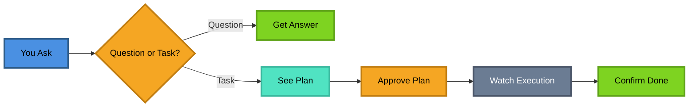

**For Questions**: You ask → You get an answer
**For Tasks**: You ask → See plan → Approve → Watch it happen → Confirm done

### Universal Coordinator Philosophy

OpenAgent is a **universal coordinator** - it handles general tasks directly:

**Capabilities**: Answer questions, create documentation, simple code updates, workflow coordination, task planning, general research, file operations

**Default**: Execute directly for general tasks, fetch context files as needed (lazy), keep it simple, don't over-delegate

**Delegate to opencoder when**: Complex multi-file coding, architecture analysis, deep refactoring, pattern implementation

**Delegate to specialists when**: Testing needed (@tester), review needed (@reviewer), complex task breakdown (@task-manager), comprehensive documentation (@documentation)

This means OpenAgent is your go-to coordinator for general tasks and questions. For deep coding work, use **opencoder**.

---

## The Two Paths

OpenAgent has two different ways of working, depending on what you need:

### Path 1: Conversational (For Questions)

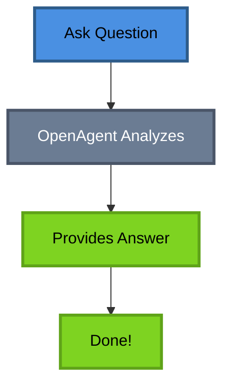

**When**: You ask informational questions
**Examples**:
- "What's the difference between REST and GraphQL?"
- "How do I use async/await in JavaScript?"
- "Explain what this code does"

**What Happens**: You get a direct, helpful answer. No approval needed.

---

### Path 2: Task Execution (For Actions)

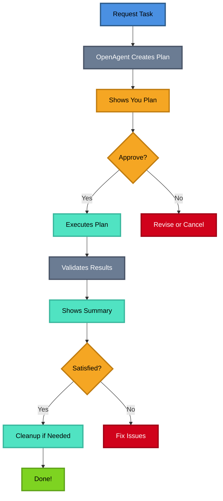

**When**: You want something done
**Examples**:
- "Create a README for this project"
- "Build a user authentication system"
- "Refactor this code to use TypeScript"

**What Happens**: 
1. You see a plan
2. You approve it
3. OpenAgent executes it
4. You confirm it's done right

---

## The 6-Stage Workflow

When you request a task, OpenAgent follows a systematic 6-stage workflow:

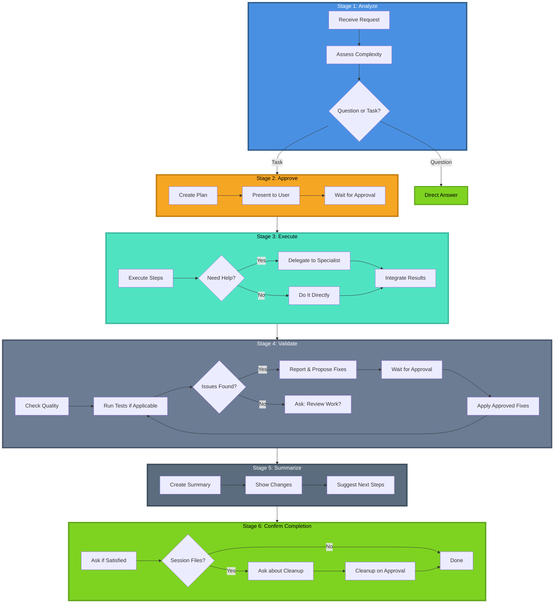

---

### Stage 1: Analyze

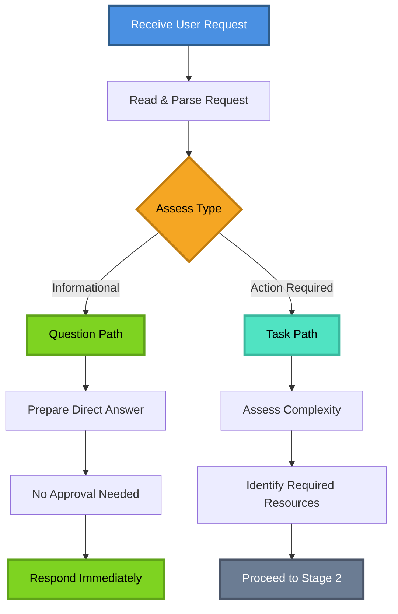

**What happens**: OpenAgent reads your request and decides if it's a question or a task.

**Your experience**: Instant - you don't see this happening.

---

### Stage 2: Approve ⚠️ (MANDATORY - CRITICAL RULE)

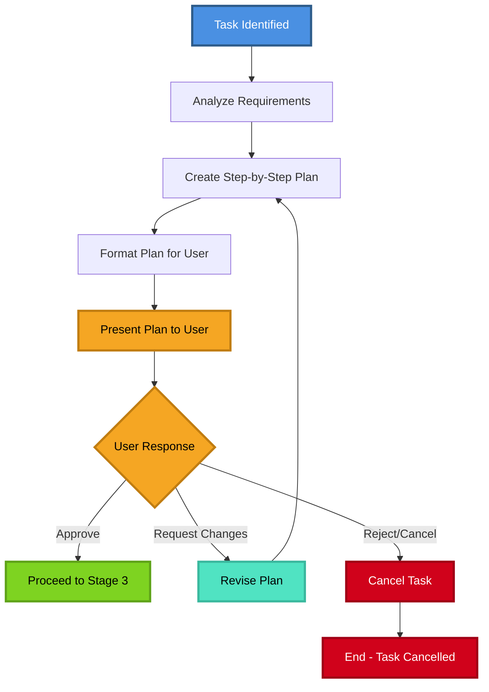

**What happens**: OpenAgent creates a plan and shows it to you.

**Critical Rule**: OpenAgent **ALWAYS** requests approval before **ANY** execution (bash, write, edit, task delegation). This is absolute and strictly enforced. Read and list operations do not require approval.

**Your experience**: You see something like:
```
## Proposed Plan
1. Create README.md file
2. Add project overview section
3. Add installation instructions
4. Add usage examples

**Approval needed before proceeding.**
```

**What you do**: Review the plan and say "yes" or "no" (or ask for changes).

---

### Stage 3: Execute

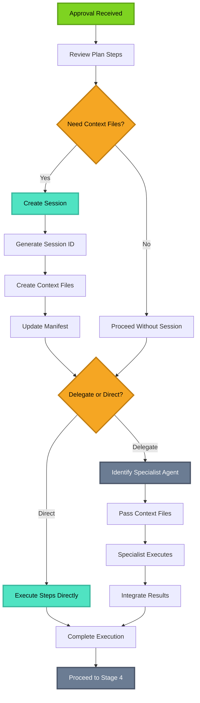

**What happens**: OpenAgent carries out the plan, either directly or by delegating to specialist agents.

**Your experience**: You might see:
- Files being created or modified
- Commands being run
- Progress updates
- Results from specialist agents

**Behind the scenes**: OpenAgent might create temporary files to preserve context between steps.

---

### Stage 4: Validate ⚠️ (MANDATORY - CRITICAL RULE)

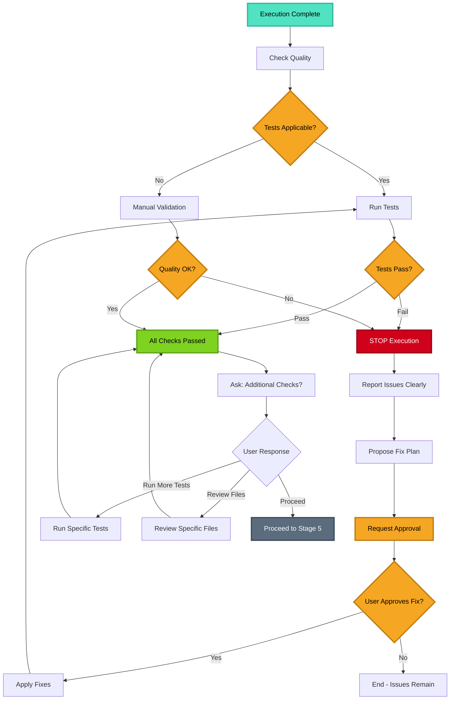

**What happens**: OpenAgent checks the quality of the work, runs tests if applicable, and ensures everything works correctly.

**Critical Rules Enforced**:
1. **STOP on failure** - Immediately stops execution when tests fail or errors occur
2. **REPORT first** - Always reports issues before proposing fixes
3. **NEVER auto-fix** - Always requests approval before fixing issues

**Your experience when validation passes**: You see:
```
✅ Validation complete - all checks passed.

Would you like me to run any additional checks or review the work before I summarize?
- Run specific tests
- Check specific files  
- Review changes
- Proceed to summary
```

**What you do**: Choose to review further or proceed to summary.

#### Special Case: Test Failures or Issues Found

If OpenAgent runs tests or validation and finds issues, it follows a **strict protocol** (Critical Rule):

**What happens**:
1. ⛔ **STOPS** execution immediately (no auto-fix)
2. 📋 **REPORTS** all issues/failures clearly
3. 📝 **PROPOSES** a fix plan with specific steps
4. ⚠️ **REQUESTS APPROVAL** before fixing (absolute requirement)
5. ✅ **PROCEEDS** only after you approve
6. 🔄 **RE-VALIDATES** after fixes are applied

**Your experience**: You see something like:
```
## Validation Results
❌ 3 tests failed:
- test_user_auth: Expected 200, got 401
- test_login: Missing token in response
- test_logout: Session not cleared

## Proposed Fix Plan
1. Update auth middleware to return proper status codes
2. Add token generation to login endpoint
3. Add session cleanup to logout handler

**Approval needed before proceeding with fixes.**
```

**Critical**: OpenAgent will **NEVER** auto-fix issues without your explicit approval. This is an absolute rule with strict enforcement. After fixes are applied, validation runs again to ensure everything passes.

---

### Stage 5: Summarize

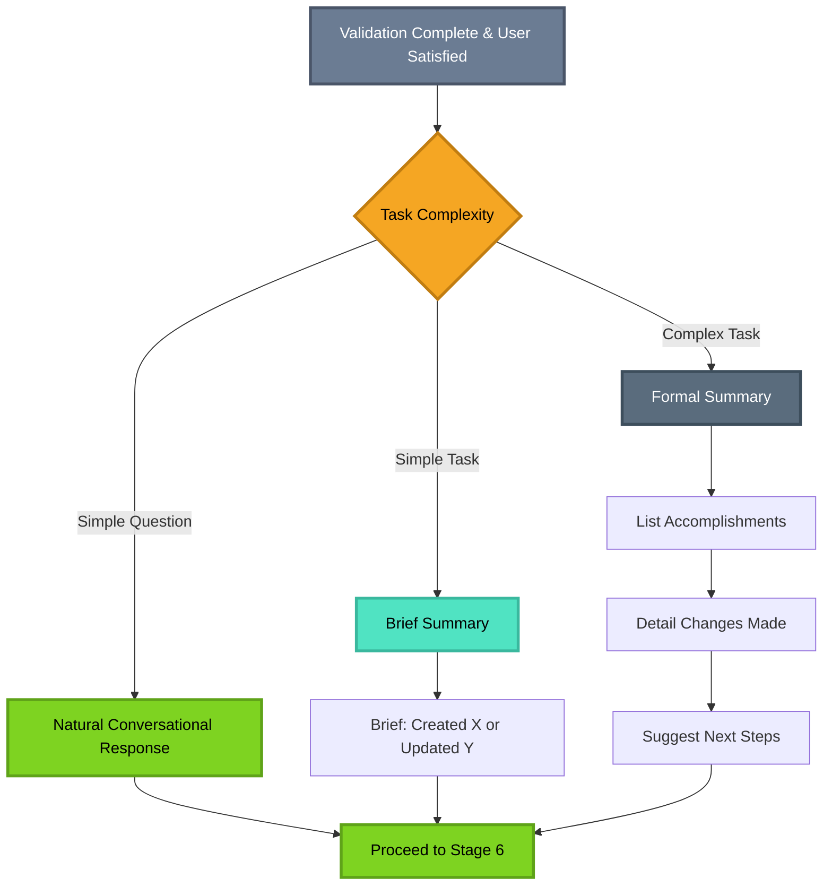

**What happens**: After validation passes and you're satisfied, OpenAgent creates a summary of what was accomplished.

**Your experience**: You see a summary like:
```
## Summary
Created README.md with project documentation.

**Changes Made:**
- Created README.md
- Added project overview
- Added installation guide
- Added usage examples

**Next Steps:** Review the README and update as needed.
```

---

### Stage 6: Confirm Completion ⚠️ (MANDATORY - CRITICAL RULE)

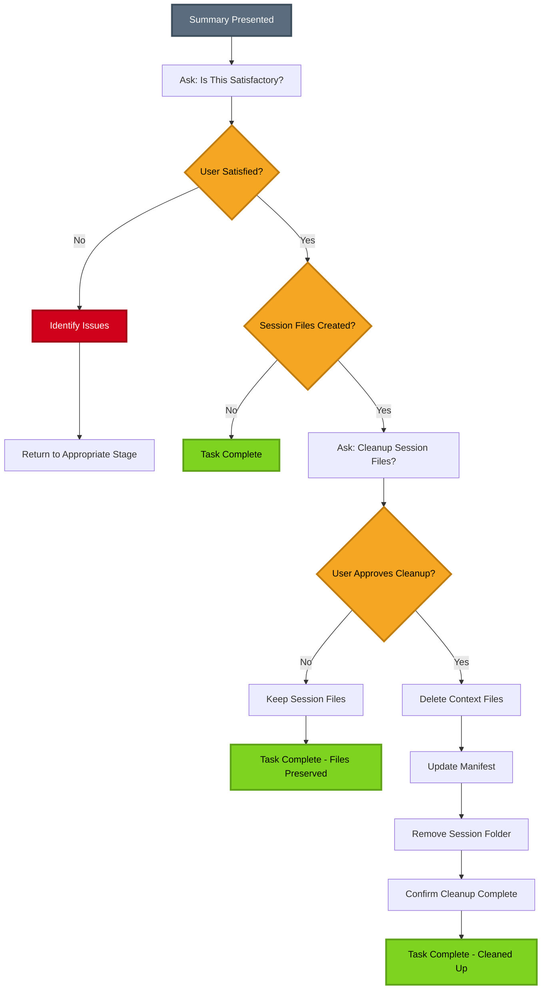

**What happens**: OpenAgent asks if you're satisfied and if temporary files should be cleaned up.

**Critical Rule**: OpenAgent **ALWAYS** confirms before deleting session files or cleanup operations. This is absolute and strictly enforced.

**Your experience**: You see:
```
Is this complete and satisfactory?
Should I clean up temporary session files at .tmp/sessions/20250118-143022-a4f2/?
```

**What you do**: Confirm you're happy with the results and approve cleanup if needed.

---

## Session Management

When OpenAgent works on complex tasks, it creates a **session** to keep track of everything.

### What is a Session?

A session is like a **temporary workspace** where OpenAgent stores:
- Context files (requirements, specifications)
- Task breakdowns
- Notes for specialist agents
- Progress tracking

### Session Structure

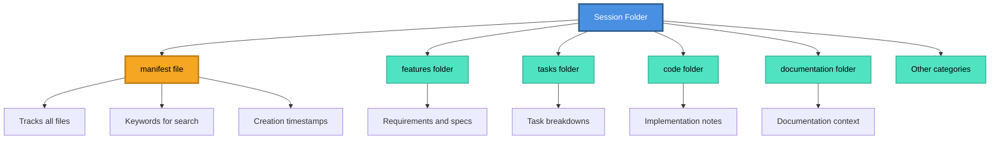

### Session Lifecycle

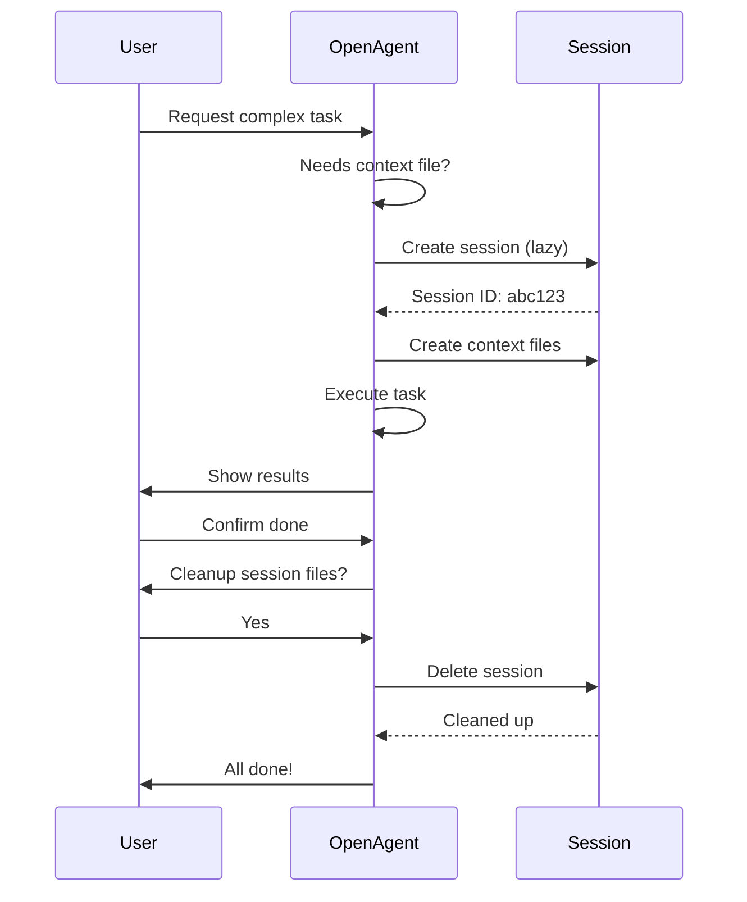

### Key Features

**Lazy Initialization**: Sessions are only created when actually needed (not for simple tasks). OpenAgent follows a "lazy" philosophy - only creates sessions/files when truly necessary.

**Unique IDs**: Each session gets a unique ID like `20250118-143022-a4f2` to prevent conflicts.

**Safe Cleanup**: OpenAgent only deletes files it created, and only after you approve (Critical Rule).

**Concurrent Safety**: Multiple users can work simultaneously without interfering with each other.

---

## Dynamic Context Loading

One of OpenAgent's superpowers is **remembering context** across multiple steps.

### The Problem It Solves

Imagine this scenario:
1. You ask: "Build a user authentication system"
2. OpenAgent creates requirements and task breakdown
3. Later, you ask: "Implement the login component"

**Without context loading**: OpenAgent wouldn't remember the requirements from step 1.
**With context loading**: OpenAgent finds and uses the requirements automatically.

### How It Works

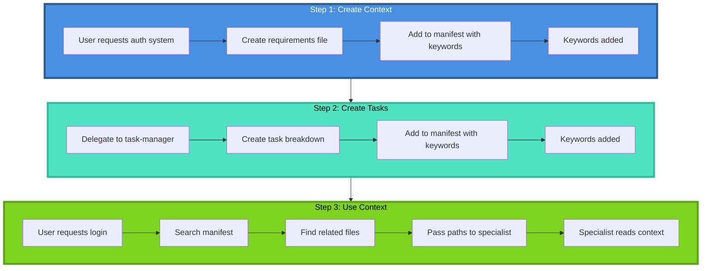

### The Manifest

The manifest is like an **index** that tracks all context files:

```json
{
  "session_id": "20250118-143022-a4f2",
  "context_files": {
    "features/user-auth-context.md": {
      "created": "2025-01-18T14:30:22Z",
      "for": "@task-manager",
      "keywords": ["user-auth", "authentication", "features"]
    },
    "tasks/user-auth-tasks.md": {
      "created": "2025-01-18T14:32:15Z",
      "for": "@task-manager",
      "keywords": ["user-auth", "tasks", "breakdown"]
    }
  },
  "context_index": {
    "user-auth": [
      "features/user-auth-context.md",
      "tasks/user-auth-tasks.md"
    ]
  }
}
```

**Benefits**:
- ✅ No context loss across steps
- ✅ Automatic discovery by keywords
- ✅ Flexible - only loads what's needed
- ✅ Traceable - you can see what context was used

---

## When OpenAgent Delegates

OpenAgent is a **universal agent** that handles most tasks directly. It only delegates when truly needed.

### Execution Philosophy

**OpenAgent's Capabilities**: Write code, docs, tests, reviews, analysis, debugging, research, bash operations, file operations

**Default Approach**: Execute directly, fetch context files as needed (lazy loading), keep it simple

**Delegate Only When**:
- 4+ files to modify/create
- Specialized expertise needed (security, algorithms, architecture, performance)
- Thorough multi-component review required
- Complex dependencies and coordination
- Need fresh perspective or alternative approaches
- Testing scenarios, edge cases, what-if analysis
- User explicitly requests breakdown/delegation

### Decision Tree

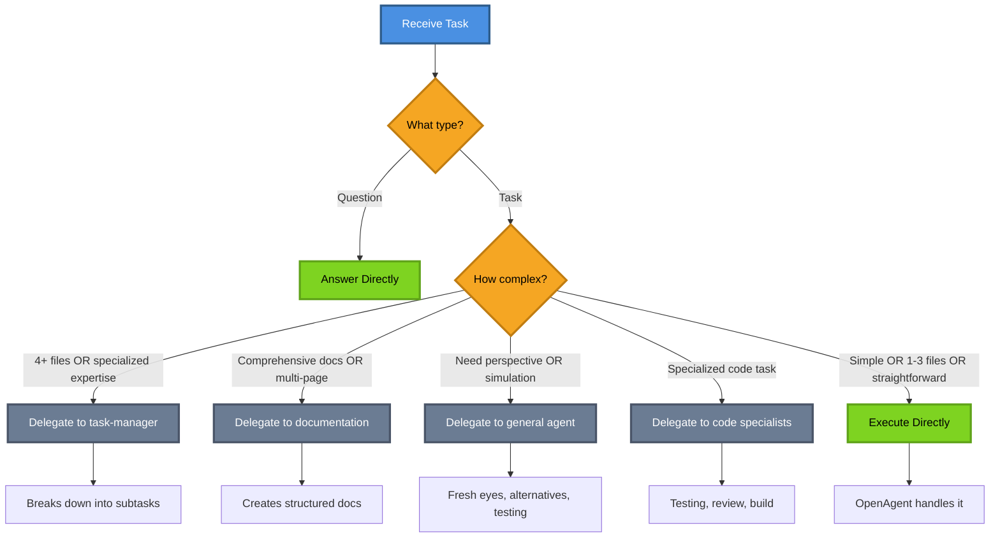

### Delegation Criteria

#### Delegate to @task-manager when:
- ✅ Feature spans **4+ files/modules**
- ✅ **Complex dependencies** between components
- ✅ Needs **breakdown into subtasks**
- ✅ User **explicitly requests** task breakdown

**Example**: "Build user authentication system with 5+ components"

---

#### Delegate to @documentation when:
- ✅ Creating **comprehensive docs** (API docs, guides, tutorials)
- ✅ **Multi-page** documentation
- ✅ Requires **codebase analysis/research**
- ✅ User **explicitly requests** documentation agent

**Example**: "Create API documentation for all endpoints"

---

#### Delegate to @general agent when:
- ✅ Need **fresh perspective** or alternative approaches
- ✅ **Simulation** of scenarios, edge cases, what-if analysis
- ✅ **Brainstorming** different solutions
- ✅ **Complex research** requiring multiple rounds of search

**Examples**:
- "Review this API design - what could go wrong?" → Fresh perspective
- "Simulate edge cases for this algorithm" → Testing scenarios
- "What are alternative approaches to solve X?" → Brainstorming

---

#### Delegate to @code/* when:
- ✅ **Specialized code task** (testing, review, build)
- ✅ **Thorough review** across multiple components
- ✅ Code subagents are **available** in current profile

**Examples**:
- "Review this code for security issues" → @code/reviewer
- "Write tests for this module" → @code/tester
- "Run build and fix errors" → @code/build-agent

---

#### Execute directly when:
- ✅ **1-3 files** to modify/create
- ✅ **Straightforward** task with clear implementation
- ✅ **Quick updates/edits**
- ✅ User **explicitly asks** openagent to handle it

**Examples**:
- "Create a README"
- "Fix this bug in auth.ts"
- "Add input validation to this function"
- "Update this function to use async/await"

---

## Visual Workflows

### Complete Task Workflow

```mermaid
sequenceDiagram
    participant User
    participant OpenAgent
    participant Session
    participant Specialist
    
    User->>OpenAgent: "Build authentication system"
    
    Note over OpenAgent: Stage 1: Analyze
    OpenAgent->>OpenAgent: Complex task, needs task-manager
    
    Note over OpenAgent: Stage 2: Approve
    OpenAgent->>User: ## Proposed Plan<br/>1. Create requirements<br/>2. Delegate to task-manager<br/>3. Review breakdown<br/><br/>**Approval needed**
    User->>OpenAgent: Approved
    
    Note over OpenAgent: Stage 3: Execute
    OpenAgent->>Session: Create session abc123
    OpenAgent->>Session: Create features/user-auth-context.md
    Session-->>OpenAgent: File created, added to manifest
    
    OpenAgent->>Specialist: @task-manager: Break down auth system<br/>Context: .tmp/sessions/abc123/features/user-auth-context.md
    Specialist->>Session: Create tasks/user-auth-tasks.md
    Specialist-->>OpenAgent: Task breakdown complete
    
    OpenAgent->>Session: Update manifest with new file
    
    Note over OpenAgent: Stage 4: Validate
    OpenAgent->>OpenAgent: Check quality, run tests
    OpenAgent->>User: ✅ Validation complete - all checks passed.<br/><br/>Would you like me to run any additional checks<br/>or review the work before I summarize?
    User->>OpenAgent: Proceed to summary
    
    Note over OpenAgent: Stage 5: Summarize
    OpenAgent->>User: ## Summary<br/>Created task breakdown with 5 subtasks<br/><br/>**Changes:**<br/>- Created context file<br/>- Created task breakdown
    
    Note over OpenAgent: Stage 6: Confirm
    OpenAgent->>User: Is this complete and satisfactory?<br/>Should I clean up session files?
    User->>OpenAgent: Yes, looks good. Clean up.
    OpenAgent->>Session: Delete session abc123
    Session-->>OpenAgent: Cleaned up
    OpenAgent->>User: ✓ All done!
```

### Multi-Step with Context Preservation

```mermaid
sequenceDiagram
    participant User
    participant OpenAgent
    participant Manifest
    participant Specialist
    
    Note over User,Specialist: Step 1: Initial Request
    User->>OpenAgent: "Build auth system"
    OpenAgent->>Manifest: Create features/user-auth-context.md<br/>Keywords: [user-auth, authentication]
    OpenAgent->>Specialist: @task-manager
    Specialist->>Manifest: Create tasks/user-auth-tasks.md<br/>Keywords: [user-auth, tasks]
    
    Note over User,Specialist: Step 2: Later Request
    User->>OpenAgent: "Implement login component"
    OpenAgent->>Manifest: Search for "login" or "user-auth"
    Manifest-->>OpenAgent: Found:<br/>- features/user-auth-context.md<br/>- tasks/user-auth-tasks.md
    OpenAgent->>Specialist: @coder-agent: Implement login<br/><br/>Related context:<br/>- features/user-auth-context.md<br/>- tasks/user-auth-tasks.md
    Specialist->>Manifest: Read context files
    Specialist-->>OpenAgent: Login component implemented with full context
    
    Note over OpenAgent: ✓ No context loss!
```

### Concurrent Sessions

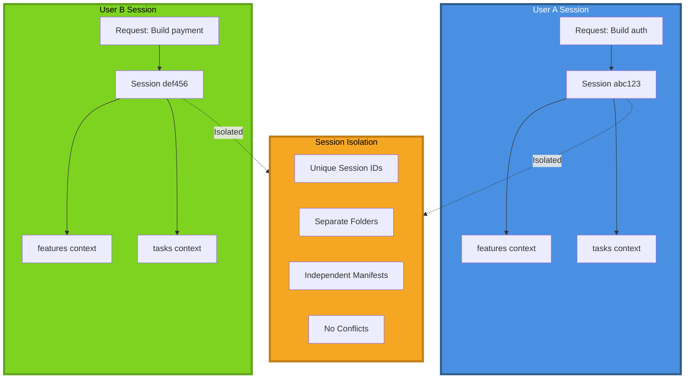

---

## Tips for Your Workflow

### 1. Be Specific in Your Requests

**Instead of**: "Make this better"
**Try**: "Refactor this function to use async/await and add error handling"

**Why**: Specific requests help OpenAgent create better plans and get approval faster.

---

### 2. Review Plans Carefully

When OpenAgent shows you a plan, take a moment to review it:
- ✅ Does it match what you want?
- ✅ Are there any steps you'd change?
- ✅ Is anything missing?

**Tip**: You can ask OpenAgent to revise the plan before approving.

---

### 3. Use Multi-Step Workflows

For complex projects, break them into steps:

```
Step 1: "Build user authentication system"
→ Review task breakdown

Step 2: "Implement the registration component"
→ OpenAgent uses context from Step 1

Step 3: "Implement the login component"
→ OpenAgent uses context from Steps 1 & 2
```

**Why**: OpenAgent preserves context across steps, making each step easier.

---

### 4. Leverage Specialist Agents

Let OpenAgent delegate to specialists:
- **Complex features** → Let task-manager break them down
- **Documentation** → Let documentation agent create comprehensive docs
- **Code review** → Let reviewer agent check for issues

**Tip**: You can explicitly request a specialist: "Use the documentation agent to create API docs"

---

### 5. Clean Up Sessions Regularly

After completing a workflow, approve session cleanup:
- ✅ Keeps your workspace clean
- ✅ Prevents accumulation of temporary files
- ✅ Frees up disk space

**Tip**: You can also manually clean up stale sessions:
```bash
./scripts/maintenance/cleanup-stale-sessions.sh
```

---

### 6. Use Keywords Consistently

When working on related tasks, use consistent terminology:
- "user authentication" (not "auth" in one request and "login system" in another)
- "payment processing" (not "payments" and "checkout" interchangeably)

**Why**: Helps OpenAgent find related context files more easily.

---

### 7. Provide Context for Follow-Up Requests

When making follow-up requests, reference previous work:

**Good**: "Implement the login component from the auth system we planned earlier"
**Better**: "Implement the login component using the user-auth requirements"

**Why**: Helps OpenAgent search for the right context files.

---

### 8. Customize Delegation Thresholds

You can adjust when OpenAgent delegates by modifying the criteria in `.opencode/agent/openagent.md`:

**Current defaults**:
- 4+ files → Delegate to task-manager
- Specialized expertise needed → Delegate to appropriate specialist
- 1-3 files → Execute directly

**To customize**: Edit the `<delegation_rules>` section to match your preferences.

---

### 9. Create Your Own Categories

The default categories are:
- features, documentation, code, refactoring, testing, tasks, general

**To add custom categories**: Edit the `<categories>` line in openagent.md:
```xml
<categories>features | documentation | code | refactoring | testing | general | tasks | your-category</categories>
```

**Use case**: If you frequently work on "migrations" or "integrations", add those as categories.

---

### 10. Monitor Session Files

Occasionally check `.tmp/sessions/` to see what context is being preserved:

```bash
ls -la .tmp/sessions/
```

**Why**: Helps you understand what context OpenAgent is using and identify any issues.

---

### 11. Use Explicit Approvals for Learning

When learning a new codebase or technology, use OpenAgent's approval step as a learning opportunity:
- Read the plan carefully
- Ask questions about steps you don't understand
- Request explanations before approving

**Example**:
```
OpenAgent: "I'll refactor this to use dependency injection"
You: "What is dependency injection and why is it better here?"
OpenAgent: [Explains]
You: "Got it, approved!"
```

---

### 12. Combine with Other Agents

OpenAgent works great with other agents in your profile:
- Use OpenAgent for planning and coordination
- Let specialists handle their domains
- OpenAgent will preserve context between them

**Example workflow**:
1. OpenAgent plans the feature
2. @coder-agent implements it
3. @tester writes tests
4. @reviewer checks quality
5. @documentation documents it

All coordinated by OpenAgent with preserved context!

---

## Advanced Tips

### Create Reusable Context Templates

For recurring workflows, create context templates:

**Example**: `.opencode/templates/feature-context.md`
```markdown
# Feature: {FEATURE_NAME}

## Requirements
- [List requirements]

## Constraints
- [List constraints]

## Success Criteria
- [List criteria]
```

**Use**: "Create a new feature using the feature-context template"

---

### Use Session IDs for Debugging

If something goes wrong, note the session ID:
```
Session: 20250118-143022-a4f2
```

You can inspect the session folder to see what context was created:
```bash
cat .tmp/sessions/20250118-143022-a4f2/.manifest.json
```

---

### Batch Related Tasks

Group related tasks in one session for better context:

**Instead of**:
- Request 1: "Create user model"
- Request 2: "Create auth controller"
- Request 3: "Create login route"

**Try**:
- Request: "Build user authentication with model, controller, and routes"

**Why**: Single session, all context preserved, more efficient.

---

## Core Principles

OpenAgent follows these core principles:

### 🎯 Lean
Concise responses, no over-explanation. Gets to the point quickly.

### 🔄 Adaptive
Conversational for questions, formal for tasks. Matches the context.

### ⚡ Lazy
Only creates sessions/files when actually needed. No unnecessary overhead. Fetches context files on-demand.

### 🔒 Safe (CRITICAL RULE - Absolute & Strict)
**ALWAYS** requests approval before ANY execution (bash, write, edit, task delegation). Confirms before cleanup. This is an absolute rule with strict enforcement.

### 📋 Report First (CRITICAL RULE - Absolute & Strict)
When tests fail or issues are found:
1. **STOP** immediately (no auto-fix)
2. **REPORT** the issues clearly
3. **PROPOSE** fix plan
4. **REQUEST APPROVAL** (mandatory)
5. **FIX** (only after approval)

**Never auto-fixes** - you're always in control. This is an absolute rule with strict enforcement.

### 🛡️ Critical Rules Summary
Three critical rules are enforced with absolute priority:
1. **Approval Gate** - Always request approval before execution
2. **Stop on Failure** - Stop immediately on test failures or errors, never auto-fix
3. **Confirm Cleanup** - Always confirm before deleting session files

---

## Summary

OpenAgent is your **intelligent universal agent** that:

✅ **Plans before acting** - Shows you the plan and waits for approval (Critical Rule)
✅ **Preserves context** - Remembers information across multiple steps
✅ **Executes directly** - Handles most tasks itself, delegates only when needed
✅ **Keeps you in control** - Always confirms before cleanup (Critical Rule)
✅ **Handles general tasks** - Questions, docs, coordination, simple updates (delegates complex coding to opencoder)
✅ **Reports before fixing** - Never auto-fixes issues without approval (Critical Rule)

**Key Takeaways**:
1. Be specific in your requests
2. Review plans before approving
3. Use multi-step workflows for complex projects
4. OpenAgent handles most tasks directly - delegation is the exception, not the rule
5. Clean up sessions when done
6. Customize to fit your workflow
7. Expect reports before fixes when issues are found (never auto-fix)

**Ready to get started?** Just ask OpenAgent a question or request a task!

---

## Configuration

OpenAgent is configured in `.opencode/agent/openagent.md`. You can customize:
- Delegation thresholds (when to delegate vs execute directly)
- Execution philosophy (universal agent approach)
- Critical rules enforcement
- Workflow stages
- Context loading behavior
- And more!

### Architecture & Design (Nov 2025)

OpenAgent has been optimized based on research-backed prompt engineering patterns:

✅ **Critical rules positioned early** - Safety rules appear in the first 15% of the prompt with absolute priority
✅ **Minimal nesting complexity** - Flattened XML structure (max 2 levels) for maximum clarity
✅ **Modular design** - Context files loaded on-demand (lazy loading)
✅ **Explicit prioritization** - 3-tier priority system with conflict resolution
✅ **Single source of truth** - Critical rules defined once and referenced throughout
✅ **Universal agent philosophy** - Execute directly first, delegate only when truly needed

**Key Principles**:
- **Tier 1 (Highest)**: Safety & Approval Gates - Always override other tiers
- **Tier 2**: Core Workflow - Stage progression and delegation routing
- **Tier 3**: Optimization - Lazy initialization, session management, context discovery

**Effectiveness improvements are model- and task-specific.** These patterns are validated by Stanford/Anthropic research but actual performance gains vary based on your specific use case.

### Static Context Files

OpenAgent uses context files from `.opencode/context/core/` on-demand (lazy loading):

**Standards** (quality guidelines):
- `standards/code.md` - Modular, functional code patterns
- `standards/docs.md` - Documentation standards
- `standards/tests.md` - Testing standards
- `standards/patterns.md` - Core patterns
- `standards/analysis.md` - Analysis framework

**Workflows** (process templates):
- `workflows/delegation.md` - Delegation template and process
- `workflows/task-breakdown.md` - Task breakdown methodology
- `workflows/sessions.md` - Session lifecycle management
- `workflows/review.md` - Code review guidelines

These files are fetched only when needed, keeping the system lean and efficient. OpenAgent references them without the `@` symbol (e.g., `standards/code.md` not `@standards/code.md`).

Happy building! 🚀
